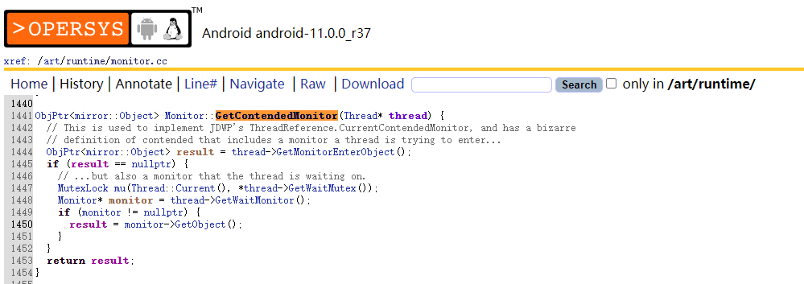
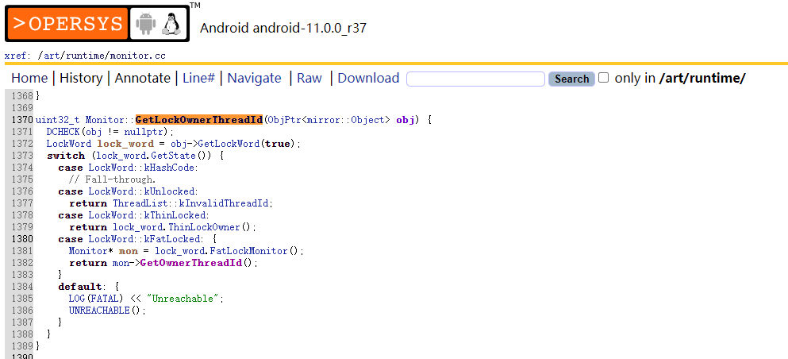

> 在日常开发中，当出现锁被长期持有或者出现死锁，造成流程无法正常执行，甚至产生ANR，这时候就需要获取被阻塞的线程和持有锁的线程，该 demo 展示了如何获取被阻塞的线程和持有锁的线程相关调用链

# 获取锁调用链

需要知道当前线程在等待那个锁，以及这个锁被那个线程持有，然后把发生死锁的线程堆栈信息搜集起来

流程如下：

1. 获取当前 `blocked` 状态的线程
2. 获取该线程想要竞争的锁
3. 获取该锁被那个线程持有
4. 通过关系链，判断死锁的线程，输出堆栈信息

在 Java 层并没有相关 API 可以实现死锁监控，可以从 Native 层入手

#### 一、获取当前 blocked 状态的线程

根据线程状态得到 `blocked` 的线程，并获取它的内存地址指针 `nativePeer`

```kotlin
val allThreads = getAllThreads()
for (thread in allThreads) {
    if (thread!!.state == Thread.State.BLOCKED) {
        val nativePeer = (ReflectUtil.getField(Thread::class.java, thread, "nativePeer") as? Long) ?: 0
        if (nativePeer == 0L) {
            // 内存地址指针等于0，说明未创建、启动或已销毁
            continue
        }
    }
}
```

得到 `blocked` 线程的内存地址指针后，接下来需要寻找第二第三步 Native 层中所需要的函数

#### 二、Native层：获取当前线程想要竞争的锁和获取目标锁被哪个线程持有

* 获取当前线程想要竞争的锁

  函数：`Monitor::GetContendedMonitor`

  从源码和源码的解释可以看出，这个函数是用来获取当前线程等待的Monitor

  源码：http://aosp.opersys.com/xref/android-11.0.0_r37/xref/art/runtime/monitor.cc

  

* 获取目标锁被哪个线程持有

  函数：`Monitor::GetLockOwnerThreadId`

  源码：http://aosp.opersys.com/xref/android-11.0.0_r37/xref/art/runtime/monitor.cc

  

我们可以通过 `dlopen` 以指定模式打开指定的动态链接库文件，并返回一个句柄给 `dlsym` 使用，随后通过 `dlclose` 关闭。

由于 `Android 7.0` 开始，系统限制 App 调用 `dlopen` `dlsym` `dladdr` `dlclose` `dlerror` 等函数使用系统动态库，这里使用 [`ndk_dlopen`](https://github.com/Rprop/ndk_dlopen) 这个库绕开这个限制，用法与原有逻辑一致，只是在调用时需要加上 `ndk_` 前缀。

参考：[Android dlopen 方法的使用限制及解决方案](https://www.sunmoonblog.com/2019/06/04/fake-dlopen/?spm=ata.13261165.0.0.bb4d1bc8hQmHlY)

#### 三、打开指定的动态链接库

涉及的相关 Native 层动态库为 `libart.so`

该库路径：

`Android 9.0` 以前：`/system/lib/libart.so`

`Android 10.0` 起：`/system/apex/com.android.adbd/lib/libart.so`

```c++
ndk_init(env); // 初始化
void *so_addr = ndk_dlopen("libart.so", RTLD_NOLOAD); // 加载libart.so
if (so_addr == nullptr) {
    return 1;
}
```

打开动态库之后，得到动态库句柄，接下来需要通过 `dlsym` 函数根据动态库句柄和函数符号返回函数对应的地址，即获取 `GetContendedMonitor` 和 `GetLockOwnerThreadId` 函数地址。

【注意】c++ 可以重载，所以它的函数符号比较特殊，需要从 `libart.so` 中获取，so库可以从上面系统目录中导出，这里提供两个命令：

```shell
nm -D libart.so | grep -E 'GetContendedMonitor|GetLockOwnerThreadId'
# 或
objdump -tT libart.so | grep -E 'GetContendedMonitor|GetLockOwnerThreadId'
```

#### 四、获取函数符号对应的函数地址

* `GetContendedMonitor` 函数这里对应的函数符号为 `_ZN3art7Monitor19GetContendedMonitorEPNS_6ThreadE`，根据函数符号地址获取函数地址

  ```c++
  get_contended_monitor = ndk_dlsym(so_addr, "_ZN3art7Monitor19GetContendedMonitorEPNS_6ThreadE");
  if (get_contended_monitor == nullptr) {
      return 2;
  }
  ```

* `GetLockOwnerThreadId` 函数对应的函数符号需要通过系统版本来判断

  ```c++
  const char *get_lock_owner_symbol_name(jint level) {
      if (level < 29) {
          //android 9.0 之前
          return "_ZN3art7Monitor20GetLockOwnerThreadIdEPNS_6mirror6ObjectE";
      } else if (level <= 30) {
          return "_ZN3art7Monitor20GetLockOwnerThreadIdENS_6ObjPtrINS_6mirror6ObjectEEE";
      } else {
          return "";
      }
  }
  ```

  根据函数符号地址获取函数地址

  ```c++
  get_lock_owner_thread_id = ndk_dlsym(so_addr, get_lock_owner_symbol_name(sdk_version));
  if (get_lock_owner_thread_id == nullptr) {
      return 3;
  }
  ```

#### 五、获取一直不释放锁的线程

```java
extern "C"
JNIEXPORT jint JNICALL
Java_com_benben_deadlockmonitordemo_DeadLockCheck_getBlockThreadNativeId(JNIEnv *env, jobject thiz,
                                                                         jlong nativePeer) {
    LOGI("getContentThreadIdArt");
    int monitor_thread_id = 0;
    if (get_contended_monitor != nullptr && get_lock_owner_thread_id != nullptr) {
        // 获取监视器
        int monitorObj = ((int (*)(long)) get_contended_monitor)(nativePeer);
        if (monitorObj != 0) {
            // 通过监视器获取具有执行权的线程id
            monitor_thread_id = ((int (*)(int)) get_lock_owner_thread_id)(monitorObj);
        } else {
            monitor_thread_id = 0;
            LOGE("get_contended_monitor return 0.");
        }
    } else {
        if (get_contended_monitor == nullptr) {
            LOGE("get_contended_monitor == null");
        }
        if (get_lock_owner_thread_id == nullptr) {
            LOGE("get_lock_owner_thread_id == null");
        }
    }
    return monitor_thread_id;
}
```

这里有两个步骤：

1. 通过 `GetContendedMonitor` 函数获取当前线程要竞争的锁监视器
2. 通过 `GetLockOwnerThreadId` 函数获取监视器的当前具有执行权的线程id

通过以上两步，就能得到一直不释放的线程id

##### 六、锁分组并打印调用栈

我们已经找的阻塞的线程和持有锁的线程，这里涉及到一个关系链：

1. 场景一：1 > 2, 2 > 1
2. 场景二：1 > 2, 2 > 3, 3 > 1
3. 场景三：1 > 2, 2 > 3, 3 > 1, other > 1
4. 其它

需要通过算法将不同场景的线程进行归纳分组，找出调用栈

弹异常框、Toast、数据上报等等

```log
18752-18752/com.benben.deadlockmonitordemo E/DL_DeadLockCheck: ~~~~~~~~~~~~~~~~~~~~~~~~~~~~~~~~~~~~start~~~~~~~~~~~~~~~~~~~~~~~~~~~~~~~~~~~~~~~
18752-18752/com.benben.deadlockmonitordemo E/DL_DeadLockCheck: waitThread = lock2 > lock3
18752-18752/com.benben.deadlockmonitordemo E/DL_DeadLockCheck: blockedThread = lock1 > lock2
18752-18752/com.benben.deadlockmonitordemo E/DL_DeadLockCheck: lock1 > lock2 stack.
    com.benben.deadlockmonitordemo.DeadLockUtil$createDeadLock$1.invoke(DeadLockUtil.kt:28)
    com.benben.deadlockmonitordemo.DeadLockUtil$createDeadLock$1.invoke(DeadLockUtil.kt:23)
    kotlin.concurrent.ThreadsKt$thread$thread$1.run(Thread.kt:30)
18752-18752/com.benben.deadlockmonitordemo E/DL_DeadLockCheck: waitThread = lock3 > lock1
18752-18752/com.benben.deadlockmonitordemo E/DL_DeadLockCheck: blockedThread = lock2 > lock3
18752-18752/com.benben.deadlockmonitordemo E/DL_DeadLockCheck: lock2 > lock3 stack.
    com.benben.deadlockmonitordemo.DeadLockUtil$createDeadLock$2.invoke(DeadLockUtil.kt:39)
    com.benben.deadlockmonitordemo.DeadLockUtil$createDeadLock$2.invoke(DeadLockUtil.kt:34)
    kotlin.concurrent.ThreadsKt$thread$thread$1.run(Thread.kt:30)
18752-18752/com.benben.deadlockmonitordemo E/DL_DeadLockCheck: waitThread = lock1 > lock2
18752-18752/com.benben.deadlockmonitordemo E/DL_DeadLockCheck: blockedThread = lock3 > lock1
18752-18752/com.benben.deadlockmonitordemo E/DL_DeadLockCheck: lock3 > lock1 stack.
    com.benben.deadlockmonitordemo.DeadLockUtil$createDeadLock$3.invoke(DeadLockUtil.kt:50)
    com.benben.deadlockmonitordemo.DeadLockUtil$createDeadLock$3.invoke(DeadLockUtil.kt:45)
    kotlin.concurrent.ThreadsKt$thread$thread$1.run(Thread.kt:30)
18752-18752/com.benben.deadlockmonitordemo E/DL_DeadLockCheck: ~~~~~~~~~~~~~~~~~~~~~~~~~~~~~~~~~~~~end~~~~~~~~~~~~~~~~~~~~~~~~~~~~~~~~~~~~~~~
```

#### 注意事项

由于时通过动态链接的形式获取的线程信息，需要考虑系统兼容性，如鸿蒙系统、各个厂家的系统、不同安卓版本的系统等等，在线上使用可以只针对已经稳定测试过的系统开放

